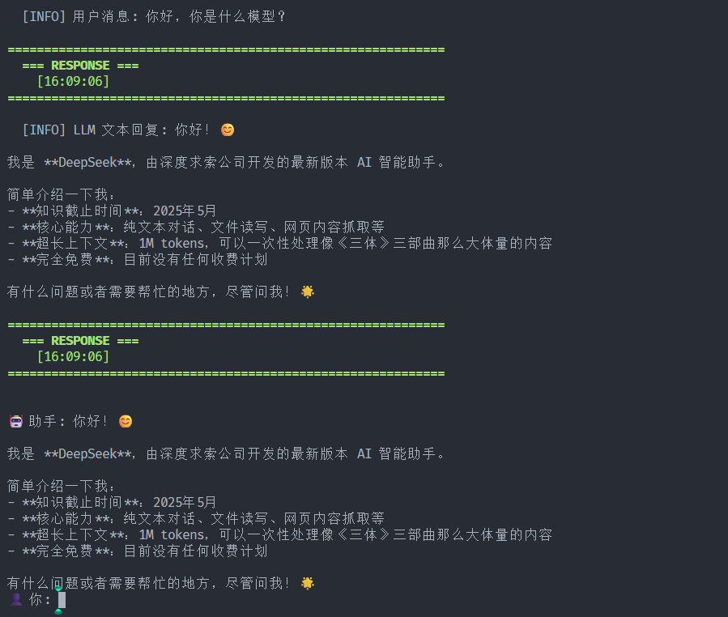
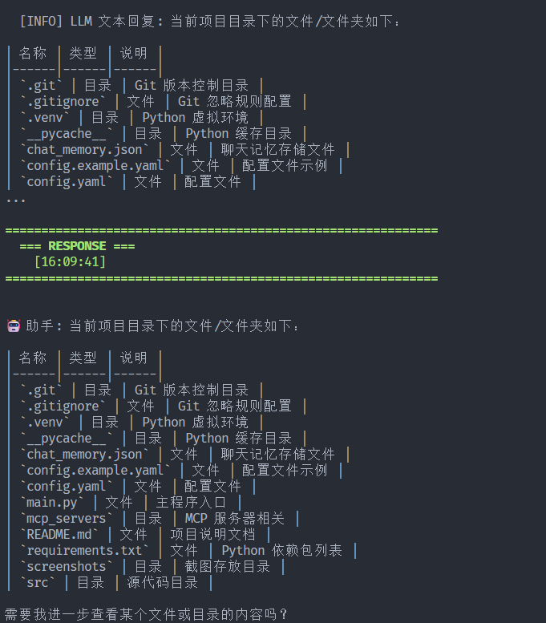
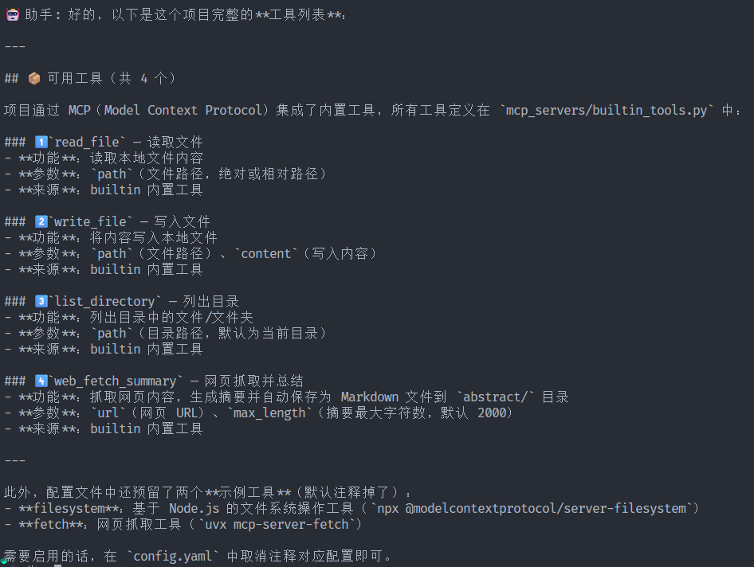
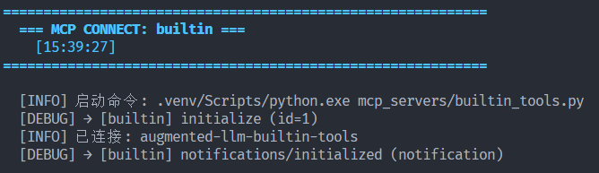
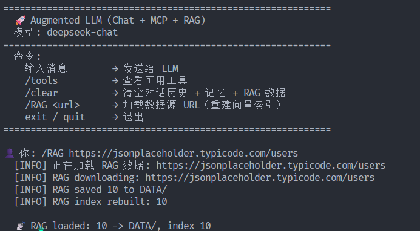
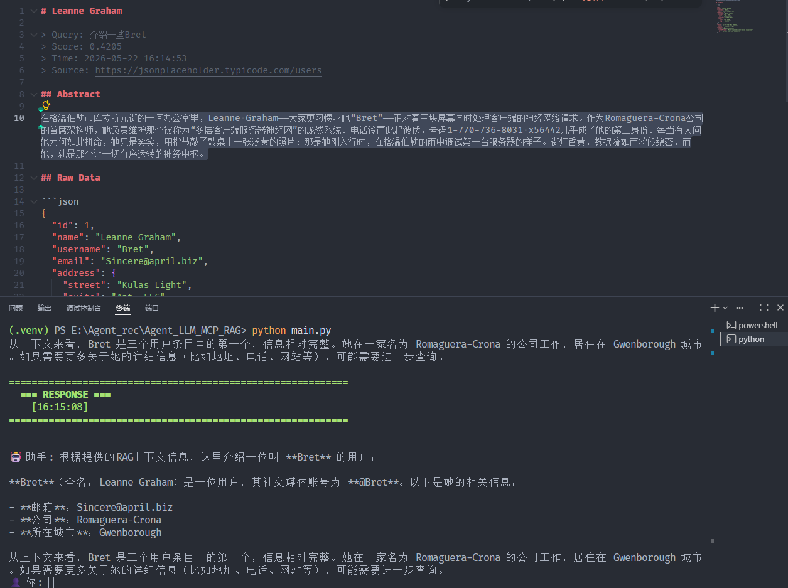
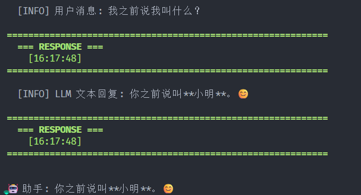
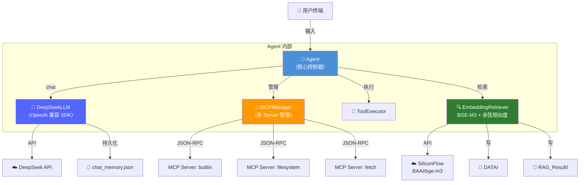

# 🤖 Augmented LLM — Chat + MCP + RAG

> **从零构建的增强型 LLM 应用** — 不依赖 LangChain、LlamaIndex 等框架，深入理解 LLM Agent 底层工作原理。

[](https://www.python.org/)
[](https://platform.deepseek.com/)
[](https://modelcontextprotocol.io/)
[]()

---

## 📖 目录

- [快速开始](#-快速开始)
- [配置说明](#-配置说明)
- [功能演示](#-功能演示)
  - [1. Chat 对话](#1-chat-对话)
  - [2. Tool-Use 工具调用](#2-tool-use-工具调用)
  - [3. MCP 多 Server](#3-mcp-多-server)
  - [4. RAG 检索增强生成](#4-rag-检索增强生成)
  - [5. 长期记忆](#5-长期记忆)
- [架构概览](#-架构概览)
- [项目结构](#-项目结构)
- [日志横幅说明](#-日志横幅说明)
- [Chat → Tool-Use 决策流程](#-chat--tool-use-决策流程)
- [MCP Server 扩展](#-mcp-server-扩展)

---

## 🚀 快速开始

```bash
# 1. 克隆项目
git clone https://github.com/PepsiCo24/LLM_MCP_RAG.git
cd LLM_MCP_RAG

# 2. 创建虚拟环境
python -m venv .venv
.venv\Scripts\Activate.ps1   # Windows
# source .venv/bin/activate   # macOS/Linux

# 3. 安装依赖
pip install -r requirements.txt

# 4. 配置密钥
cp config.example.yaml config.yaml
# 编辑 config.yaml，填入你的 DeepSeek API Key 和 SiliconFlow API Key

# 5. 启动
python main.py
```

---

## ⚙️ 配置说明

`config.yaml` 结构：

```yaml
llm:
  api_key: "sk-xxx"           # DeepSeek API Key
  base_url: "https://api.deepseek.com"
  model: "deepseek-chat"

embedding:
  api_key: "sk-xxx"           # SiliconFlow API Key
  base_url: "https://api.siliconflow.cn/v1"
  model: "BAAI/bge-m3"
  top_k: 3                    # RAG 检索返回的最大条数

mcp_servers:
  - name: "builtin"
    command: ".venv/Scripts/python.exe"
    args: ["mcp_servers/builtin_tools.py"]

system:
  max_tool_rounds: 10         # 单次对话最大工具调用轮数
  memory_file: "chat_memory.json"
```

---

## 🎬 功能演示

### 1. Chat 对话

普通对话，LLM 直接回复文本。

```text
👤 你: 你好，你是什么模型？

🤖 助手: 我是 DeepSeek，由深度求索公司开发的 AI 智能助手。
基于 deepseek-chat 模型，我可以帮你回答问题、处理文件、搜索信息等。
有什么我可以帮你的吗？😊
```



---

### 2. Tool-Use 工具调用

LLM 自主决定调用哪个工具，自动提取参数。

```text
👤 你: 帮我列出当前项目有哪些文件

=== CHAT ===
=== RESPONSE ===
  [INFO] LLM 返回 tool_calls: list_directory
=== TOOL USE ===
  [INFO] → list_directory(path=".")
=== TOOL RESULT ===
  [INFO] 结果: main.py / src/ / config.yaml / ...

🤖 助手: 当前项目目录包含以下文件：
- main.py — 程序入口
- src/ — 核心源码目录
- config.yaml — 配置文件
- ...
```



**可用工具列表：**

| 工具名 | 功能 | 说明 |
|--------|------|------|
| `read_file` | 读取本地文件 | 支持任意文本文件 |
| `write_file` | 写入本地文件 | 自动创建父目录 |
| `list_directory` | 列出目录内容 | 递归显示文件/文件夹 |
| `web_fetch_summary` | 网页抓取 + 摘要 | 抓取网页 → 生成摘要 → 保存到 `abstract/` |



---

### 3. MCP 多 Server

启动时自动连接所有配置的 MCP Server，聚合全部工具。

```text
=== MCP CONNECT: builtin ===
  [INFO] 启动命令: .venv/Scripts/python.exe mcp_servers/builtin_tools.py
  [INFO] 已连接: augmented-llm-builtin-tools

=== TOOLS ===
  [INFO] [builtin] 发现 4 个工具:
  [INFO]   read_file / write_file / list_directory / web_fetch_summary
  [INFO] 总计: 4 个可用工具
```



---

### 4. RAG 检索增强生成

完整流程：加载数据 → Embedding → 向量检索 → LLM 生成个性化摘要。

```text
👤 你: /RAG https://jsonplaceholder.typicode.com/users
  📡 RAG loaded: 10 -> DATA/, index 10

👤 你: 介绍一下Bret

=== RAG ===
  RAG: top_3 results (3 found):
  --- #1 score=0.4178 ---
  Name:    Leanne Graham  (@Bret)
  Email:   Sincere@april.biz
  Phone:   1-770-736-8031 x56442
  Website: hildegard.org
  Company: Romaguera-Crona
           Multi-layered client-server neural-net
  Address: Gwenborough, Kulas Light, Apt. 556
           92998-3874
  --- #2 score=0.4118 ---
  Name:    Glenna Reichert  (@Delphine)
  ...

  [INFO] RAG summaries saved: RAG_Result/ (3 items)

🤖 助手: 根据检索到的信息，Bret 是 Leanne Graham 的用户名...
```

**生成的文件：**
- `DATA/` — 原始 JSON 数据（每条一个 `.md`）
- `RAG_Result/` — 含 LLM 生成的个性化摘要（每条一个 `.md` + 汇总 `rag_*.md`）





---

### 5. 长期记忆

对话历史自动保存为 JSON，关闭终端后下次启动自动恢复。

```text
第一次启动 → 聊天 → exit
  [INFO] Memory saved: chat_memory.json (5 msgs)

第二次启动:
  [INFO] Memory restored: chat_memory.json (5 msgs)
  👤 你: 我之前说我叫什么？
  🤖 助手: 你之前说你叫小明。 ✅
```



**`/clear` 命令**会清除全部数据：

```text
👤 你: /clear
  [INFO] 已清空：对话历史 + 记忆 + DATA/ + RAG_Result/
```

---

## 🏗 架构概览



### 类关系

```
┌─────────────┐      ┌──────────────────┐      ┌─────────────────────┐
│    Agent    │─────→│   DeepSeekLLM    │      │  EmbeddingRetriever │
│  mcpClients │      │   chat()         │      │  embedDocument()    │
│  llm        │      │   appendTool()   │      │  embedQuery()       │
│  invoke()   │      │   save/loadState │      │  retrieve()         │
│  init()     │      └──────────────────┘      └──────────┬──────────┘
│  close()    │                                           │
└──────┬──────┘                                  ┌────────┴──────────┐
       │                                         │    VectorStore    │
       │                                         │  addEmbedding()   │
       │                                         │  search()         │
       │                                         └───────────────────┘
       │
       ├────→ MCPManager → MCPClient (1:N)
       │
       └────→ ToolExecutor
```

---

## 📁 项目结构

```
Agent_LLM_MCP_RAG/
├── main.py                     # 终端交互入口
├── config.example.yaml         # 配置模板
├── config.yaml                 # 实际配置（gitignore）
├── requirements.txt            # Python 依赖
├── .gitignore
├── README.md
├── chat_memory.json            # 长期记忆（gitignore）
│
├── src/                        # 核心源码
│   ├── __init__.py
│   ├── agent.py                # Agent 核心控制器
│   ├── llm.py                  # DeepSeek LLM 封装
│   ├── mcp_client.py           # 单个 MCP Server 连接
│   ├── mcp_manager.py          # 多 MCP Server 管理
│   ├── tool_executor.py        # 工具执行器
│   ├── rag.py                  # RAG：向量存储 + 检索
│   ├── config.py               # YAML 配置加载
│   ├── logger.py               # 日志横幅系统
│   └── types.py                # 数据类型定义
│
├── mcp_servers/                # MCP Server 实现
│   └── builtin_tools.py        # 内置工具集（FastMCP）
│
├── abstract/                   # 网页摘要输出（web_fetch_summary）
├── DATA/                       # RAG 原始数据
└── RAG_Result/                 # RAG 检索结果 + LLM 摘要
```

---

## 📊 日志横幅说明

每个步骤都有彩色横幅，方便学习 LLM Agent 内部流程：

| 步骤 | 横幅 | 含义 |
|------|------|------|
| 1 | `=== CHAT ===` | 用户消息发送给 LLM |
| 2 | `=== RESPONSE ===` | LLM 返回结果（文本 或 tool_calls） |
| 3 | `=== TOOL USE ===` | Agent 执行 LLM 要求的工具调用 |
| 4 | `=== TOOL RESULT ===` | 工具执行结果注入回对话 |
| 5 | `=== TOOLS ===` | 启动时列出所有可用工具 |
| 6 | `=== MCP CONNECT ===` | MCP Server 连接事件 |
| 7 | `=== RAG ===` | RAG 检索阶段（embedding → top_k） |

---

## 🧠 Chat → Tool-Use 决策流程

用户发送自然语言消息后的完整流转：

```
👤 用户: "帮我列出当前项目目录"

    ↓ 步骤 1: 封装请求
┌─────────────────────────────────────────────┐
│ POST https://api.deepseek.com/v1/chat/...   │
│ {                                           │
│   "model": "deepseek-chat",                 │
│   "messages": [                             │
│     {"role":"user","content":"帮我列出..."}  │ ← 用户原话
│   ],                                        │
│   "tools": [                                │
│     {"function":{"name":"list_directory",   │ ← 每个工具的
│      "description":"列出目录中的文件。",     │    name +
│      "parameters":{"path":"string"}}},      │    description +
│     {"function":{"name":"read_file",...}},  │    parameters
│     ...                                     │   传给 LLM
│   ],                                        │
│   "tool_choice": "auto"                     │ ← LLM 自主判断
│ }                                           │
└─────────────────────────────────────────────┘
    ↓ 步骤 2: LLM 语义匹配
┌─────────────────────────────────────────────┐
│ DeepSeek 内部推理：                          │
│ "帮我列出" → 匹配 list_directory 的 description│
│ "当前项目目录" → 自动填充 path="."           │
└─────────────────────────────────────────────┘
    ↓ 步骤 3: 返回 tool_calls
┌─────────────────────────────────────────────┐
│ RESPONSE:                                   │
│ { "tool_calls": [{                          │
│     "function": {                           │
│       "name": "list_directory",             │
│       "arguments": "{\"path\":\".\"}"       │
│     }                                       │
│   }] }                                      │
└─────────────────────────────────────────────┘
    ↓ 步骤 4-5: 执行 + 注入结果
Agent 调用 ToolExecutor 执行 → 结果注入 LLM 历史 → 继续推理
```

**核心原理**：用户的自然语言直接发给 DeepSeek，LLM 通过对比用户意图与每个工具的 `name`/`description`/`parameters` 做语义匹配，自动选择工具并填充参数。我们的代码不做任何 if-else 或正则匹配。

---

## 🔌 MCP Server 扩展

添加新 MCP Server 只需在 `config.yaml` 中加一项：

```yaml
mcp_servers:
  - name: "builtin"
    command: ".venv/Scripts/python.exe"
    args: ["mcp_servers/builtin_tools.py"]

  # 文件系统 Server
  - name: "filesystem"
    command: "npx"
    args: ["-y", "@modelcontextprotocol/server-filesystem", "E:/data"]

  # 网页抓取 Server
  - name: "fetch"
    command: "uvx"
    args: ["mcp-server-fetch"]
```

所有 Server 的工具自动聚合，LLM 统一调用。

---

## ✨ 核心特性

- **零框架依赖** — 不依赖 LangChain、LlamaIndex，只用 4 个轻量库：`openai`(DeepSeek SDK) / `mcp` / `pyyaml` / `httpx`
- **多 MCP Server** — 支持同时连接多个 MCP Server，自动聚合工具列表
- **Tool-Use 循环** — LLM 自主决定调用工具 → 执行 → 结果注入 → 继续推理
- **RAG 检索增强** — 数据 → Embedding(BGE-M3) → 向量检索 → LLM 摘要生成
- **长期记忆** — 关闭终端后对话历史持久化到 JSON，下次启动自动恢复
- **日志横幅** — 每一步都有 `=== CHAT ===` / `=== TOOL USE ===` / `=== RAG ===` 彩色横幅
- **模型身份自动注入** — 根据 `config.yaml` 的 `model` 字段动态生成系统提示词
- **DeepSeek 驱动** — 调用 `deepseek-chat` 模型，改 `model` 字段即可切换

---

## 📋 终端命令

| 命令 | 功能 |
|------|------|
| 输入消息 | 发送给 LLM（Chat / Tool-Use / RAG） |
| `/tools` | 查看所有可用工具及描述 |
| `/clear` | 清空对话历史 + 记忆 + DATA/ + RAG_Result/ |
| `/RAG <url>` | 加载 JSON 数据源 URL，重建向量索引 |
| `exit` / `quit` | 保存记忆并退出 |
