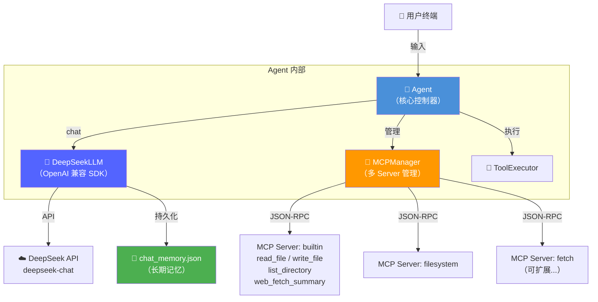
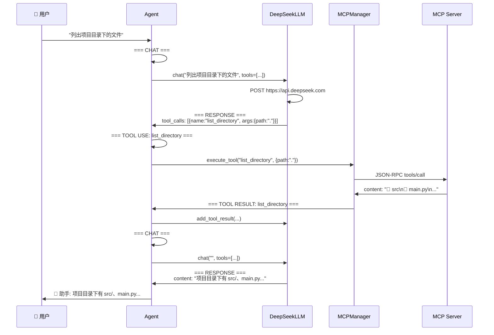

# 🤖 Augmented LLM — Chat + MCP + RAG

> **从零构建的增强型 LLM 应用** — 不依赖 LangChain、LlamaIndex 等框架写每一行代码，深入理解 LLM Agent 的底层工作原理。

[](https://www.python.org/)
[](https://platform.deepseek.com/)
[](https://modelcontextprotocol.io/)

---

## 📖 目录

- [架构概览](#-架构概览)
- [核心特性](#-核心特性)
- [项目结构](#-项目结构)
- [快速开始](#-快速开始)
- [配置说明](#-配置说明)
- [日志横幅](#-日志横幅)
- [数据流详解](#-数据流详解)
- [长期记忆](#-长期记忆)
- [RAG（待实现）](#-rag待实现)
- [MCP Server 扩展](#-mcp-server-扩展)

---

## 🏗 架构概览



### 类关系（ER 图对齐）

```
┌─────────────┐      ┌──────────────────┐
│    Agent    │─────→│   DeepSeekLLM    │
│  mcpClients │      │   (ChatOpenAI)   │
│  llm        │      │  chat()          │
│  model      │      │  appendToolResult│
│  invoke()   │      └──────────────────┘
│  init()     │
│  close()    │      ┌──────────────────┐
└──────┬──────┘─────→│   MCPManager     │
       │             │  connect_all()   │
       │             │  get_tools()     │
       │             │  execute_tool()  │
       │             └──────┬───────────┘
       │                    │ 1:N
       │             ┌──────┴───────────┐
       │             │    MCPClient     │
       │             │  command / args  │
       │             │  connect()       │
       │             │  list_tools()    │
       │             │  call_tool()     │
       │             └──────────────────┘
       │
       ▼
┌──────────────────┐    ┌──────────────────┐
│  ToolExecutor    │    │  types.py        │
│  execute()       │    │  Tool / ToolCall │
└──────────────────┘    │  LLMResponse     │
                        │  VectorStoreItem │
                        └──────────────────┘
```

---

## ✨ 核心特性

- **零框架依赖** — 不依赖 LangChain、LlamaIndex，只用 4 个轻量库：`openai`(兼容DeepSeek API) / `mcp` / `pyyaml` / `httpx`
- **多 MCP Server** — 支持同时连接多个 MCP Server，自动聚合工具列表
- **Tool-Use 循环** — LLM 自主决定调用工具 → 执行 → 结果注入 → 继续推理
- **日志横幅学习系统** — 每一步都有 `=== CHAT ===` / `=== TOOL USE ===` 等彩色横幅
- **长期记忆** — 关闭终端后对话历史持久化到 JSON，下次启动自动恢复
- **模型身份自动注入** — 根据 `config.yaml` 的 `model` 字段动态生成系统提示词
- **DeepSeek 驱动** — 调用 `deepseek-chat` 模型，使用 OpenAI 兼容 SDK；改 `model` 字段即可切换其他模型

---

## 📁 项目结构

```
LLM_MCP_RAG/
├── main.py                     # 终端交互入口
├── config.example.yaml         # 配置模板（复制为 config.yaml）
├── requirements.txt            # Python 依赖
├── .gitignore                  # Git 忽略规则
│
├── src/                        # 核心源码
│   ├── agent.py                # Agent 核心控制器
│   ├── llm.py                  # DeepSeek LLM 封装
│   ├── mcp_client.py           # 单个 MCP Server 客户端（JSON-RPC over stdio）
│   ├── mcp_manager.py          # 多 MCP Server 管理器
│   ├── tool_executor.py        # 工具调用执行器
│   ├── types.py                # 核心类型定义（Tool/ToolCall/LLMResponse）
│   ├── config.py               # YAML 配置加载
│   ├── logger.py               # 彩色日志横幅系统
│   └── __init__.py
│
└── mcp_servers/                # MCP Server 目录
    └── builtin_tools.py        # 内置工具（文件读写/网页抓取/目录列表）
```

---

## 🚀 快速开始

### 1. 环境准备

```bash
# Python 3.12+
python --version

# 创建虚拟环境
python -m venv .venv

# 激活（Windows）
.\.venv\Scripts\activate

# 安装依赖
pip install -r requirements.txt
```

### 2. 获取 API Key

访问 [DeepSeek 开放平台](https://platform.deepseek.com/api_keys) 获取免费 API Key。

### 3. 配置

```bash
# 复制配置模板
copy config.example.yaml config.yaml

# 编辑 config.yaml，填入你的 API Key
# llm:
#   api_key: "sk-xxxxxxxx"   ← 改成你的
```

### 4. 启动

```bash
python main.py
```

```text
============================================================
  🚀 Augmented LLM (Chat + MCP)
  模型: deepseek-chat
============================================================
  命令:
    输入消息      → 发送给 LLM
    /tools        → 查看可用工具
    /clear        → 清空对话历史
    /context <文本> → 设置 RAG 上下文
    exit / quit   → 退出
============================================================

👤 你: 你好，用一句话介绍你自己
🤖 助手: 我是 DeepSeek，由深度求索公司创造的 AI 智能助手...
```

### 5. 交互示例

```text
👤 你: 列出当前项目目录下的文件
🤖 助手: 项目目录下有以下文件：
  | src/      | DIR |
  | main.py   | FILE |
  | config.yaml | FILE |
  ...

👤 你: /tools
  📦 可用工具 (4):
  • [builtin] read_file — 读取本地文件内容
  • [builtin] write_file — 将内容写入本地文件
  • [builtin] list_directory — 列出目录中的文件
  • [builtin] web_fetch_summary — 抓取网页内容并生成纯文本摘要
```

---

## ⚙ 配置说明

```yaml
# config.yaml
llm:
  api_key: "sk-xxxxxxxx"           # DeepSeek API Key
  base_url: "https://api.deepseek.com"
  model: "deepseek-chat"           # 或 deepseek-reasoner / gpt-4o / qwen
  max_tokens: 4096
  temperature: 0.7

mcp_servers:
  - name: "builtin"                # 内置工具（文件/网页）
    command: ".venv/Scripts/python.exe"
    args: ["mcp_servers/builtin_tools.py"]

  # 扩展更多 MCP Server:
  # - name: "filesystem"
  #   command: "npx"
  #   args: ["-y", "@modelcontextprotocol/server-filesystem", "/path/to/data"]

system:
  max_tool_rounds: 10              # 最大工具调用轮数（防死循环）
  log_level: "INFO"                # DEBUG | INFO | WARNING
  memory_file: "chat_memory.json"  # 长期记忆文件路径
```

### 切换模型

只需修改 `model` 字段，系统会自动注入对应身份：

| model | 系统提示词 |
|-------|----------|
| `deepseek-chat` | "你是 DeepSeek，由深度求索公司创造的 AI 智能助手。" |
| `gpt-4o` | "你是 GPT-4o，由 OpenAI 开发的 AI 助手。" |
| `qwen` | "你是 Qwen（通义千问），由阿里云开发的 AI 助手。" |
| 其他 | "你是 {model} AI 智能助手。"（自动生成） |

---

## 🎨 日志横幅

每一步调用都有对应的彩色横幅，供学习底层流程：

| 横幅 | 颜色 | 触发时机 |
|------|------|---------|
| `=== CHAT ===` | 青色 | 向 LLM 发送消息 |
| `=== RESPONSE ===` | 绿色 | LLM 返回结果 |
| `=== TOOLS ===` | 蓝色 | 发现/刷新可用工具 |
| `=== TOOL USE: xxx ===` | 黄色 | 准备执行工具 |
| `=== TOOL RESULT: xxx ===` | 紫色 | 工具执行完毕 |
| `=== MCP CONNECT: xxx ===` | 蓝色 | 连接 MCP Server |
| `=== RAG ===` | 紫色 | RAG 检索（预留） |
| `=== ERROR: xxx ===` | 红色 | 异常 |

```text
============================================================
  === CHAT ===          ← 用户消息 → LLM
    [21:30:00]
============================================================

============================================================
  === RESPONSE ===      ← LLM 决定调用工具
    [21:30:01]
============================================================

============================================================
  === TOOL USE: list_directory ===   ← 执行工具
    [21:30:01]
============================================================

============================================================
  === TOOL RESULT: list_directory === ← 工具返回
    [21:30:01]
============================================================

============================================================
  === CHAT ===          ← 工具结果注入后再次 LLM
    [21:30:01]
============================================================

============================================================
  === RESPONSE ===      ← LLM 生成最终回复
    [21:30:03]
============================================================
```

---

## 🔄 数据流详解



### 工具匹配机制 — 谁决定用哪个工具？

**答案是：DeepSeek 模型内部自己决定，我们的代码完全不做匹配。**

```text
👤 "列出当前项目目录下的文件"  ← 用户自然语言，原样发送
         │
         ▼
┌──────────────────────────────────────────────────┐
│  POST https://api.deepseek.com                   │
│  {                                               │
│    "messages": [                                 │
│      {"role": "user",                            │
│       "content": "列出当前项目目录下的文件"}      │ ← 原样
│    ],                                            │
│    "tools": [                                    │
│      { "function": {                             │
│          "name": "list_directory",               │
│          "description": "列出目录中的文件。",     │ ← DeepSeek
│          "parameters": { "path": "string" }      │   用这些
│      }},                                         │   做匹配
│      { "function": { "name": "read_file", ... }},│
│      { "function": { "name": "web_fetch", ... }} │
│    ],                                            │
│    "tool_choice": "auto"                         │ ← 由模型判断
│  }                                               │
└──────────────────────────────────────────────────┘
         │
         │  DeepSeek 内部推理：
         │  "列出目录" → 语义匹配 list_directory
         │  "当前项目" → 自动填充 path="."
         ▼
┌──────────────────────────────────────────────────┐
│  RESPONSE:                                       │
│  {                                               │
│    "tool_calls": [{                              │
│      "function": {                               │
│        "name": "list_directory",  ← LLM 选的工具  │
│        "arguments": "{\"path\":\".\"}"← 自动提取  │
│      }                                           │
│    }]                                            │
│  }                                               │
└──────────────────────────────────────────────────┘
         │
         │  我们的代码只做 3 件事：
         │  ① 把工具定义传给 LLM（get_tools_for_llm）
         │  ② 解析 LLM 返回的 tool_calls 去执行（ToolExecutor）
         │  ③ 把执行结果注入回对话（add_tool_result）
         ▼
```

**关键点**：`tool_choice: "auto"` 告诉模型"你自己判断要不要用工具"。模型通过对比用户意图与每个工具的 `name`、`description`、`parameters` 做语义匹配并自动填充参数。无需任何 if-else 或正则。

### 核心循环伪代码

```python
async def invoke(self, prompt: str) -> LLMResponse:
    for round in range(1, max_tool_rounds + 1):
        # 1. 调用 LLM
        response = await self.llm.chat(prompt, tools)
        
        # 2. 有文本 → 返回给用户
        if response.content:
            print(response.content)
        
        # 3. 无工具调用 → 结束
        if not response.tool_calls:
            return response
        
        # 4. 执行工具
        results = await self.tool_executor.execute(response.tool_calls)
        
        # 5. 注入结果到 LLM 历史
        for r in results:
            self.llm.add_tool_result(r.id, r.name, r.content)
```

---

## 💾 长期记忆

对话历史自动持久化，关终端不丢失：

```text
第一次启动:
  👤 你: 我叫小明，喜欢 Python
  🤖 助手: 好的，已记住！
  exit
  → 保存到 chat_memory.json (5 条消息)

第二次启动:
  [INFO] 记忆已恢复: chat_memory.json (5 条)
  👤 你: 我的名字是什么？
  🤖 助手: 你的名字是小明 ✅
```

- `/clear` — 清空对话 + 删除记忆文件
- 直接删除 `chat_memory.json` — 重置记忆
- 记忆文件在 `.gitignore` 中，不会上传

---

## 🔮 RAG（待实现）

类型定义已就绪（`src/types.py`）：

```python
@dataclass
class VectorStoreItem:
    embedding: list[float]
    document: str

@dataclass
class RetrieverResult:
    query: str
    documents: list[str]
```

计划实现：
1. `EmbeddingRetriever` — 文档嵌入 + 向量检索
2. `VectorStore` — 内存向量存储（余弦相似度）
3. Agent 集成 — `set_context(docs)` 注入检索结果

---

## 🔌 MCP Server 扩展

添加新 MCP Server 只需在 `config.yaml` 中加一项：

```yaml
mcp_servers:
  - name: "builtin"
    command: ".venv/Scripts/python.exe"
    args: ["mcp_servers/builtin_tools.py"]
    
  # 文件系统 Server
  - name: "filesystem"
    command: "npx"
    args: ["-y", "@modelcontextprotocol/server-filesystem", "E:/data"]
    
  # 网页抓取 Server
  - name: "fetch"
    command: "uvx"
    args: ["mcp-server-fetch"]
```

所有 Server 的工具自动聚合，LLM 统一调用。
